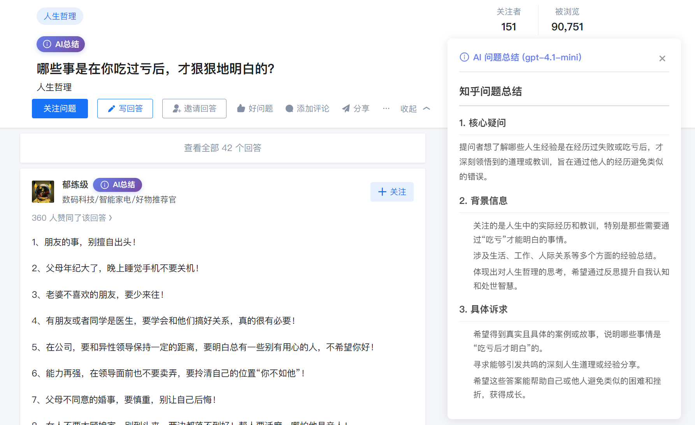
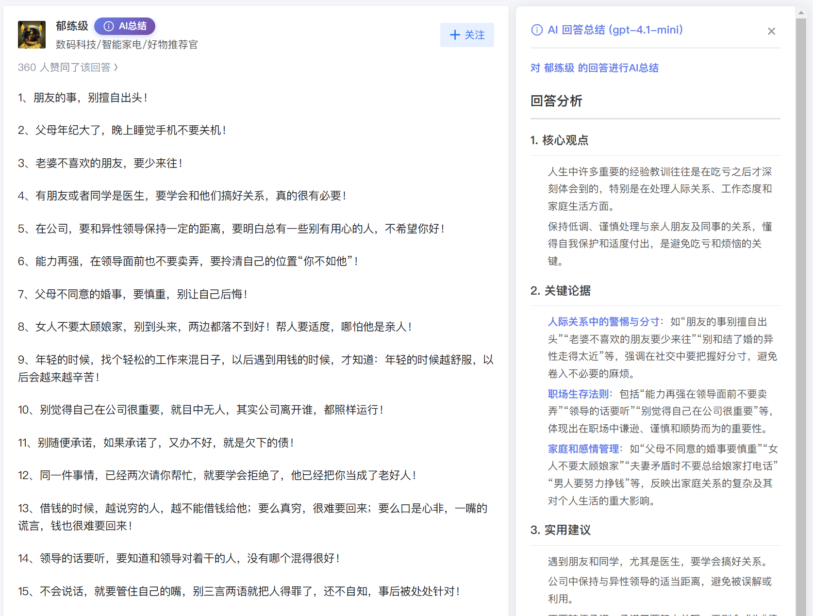

# 知乎AI总结助手

一个强大的脚本，为知乎文章、问题和回答添加AI总结功能，使用ChatGPT进行智能内容总结。

重构说明

- [原油猴脚本版](https://github.com/summer-8848/zhihu-ai-summary-tampermonkey)

- [原浏览器扩展版](https://github.com/summer-8848/zhihu-ai-summary-extension)

## 安装
- [一键安装油猴脚本](https://greasyfork.org/zh-CN/scripts/559782-%E7%9F%A5%E4%B9%8Eai%E6%80%BB%E7%BB%93%E5%8A%A9%E6%89%8B-by-summer121?locale_override=1)
- [安装浏览器扩展版](https://github.com/summer-8848/zhihu-ai-summary)

## 功能特点

- **多场景支持**：支持知乎文章、问题描述、回答内容的AI总结
- **智能总结**：调用OpenAI ChatGPT API，提供高质量的内容摘要
- **美观界面**：精心设计的UI，包括渐变按钮、优雅的弹窗和加载动画
- **易于配置**：可视化配置界面，一键保存API Key
- **自动适配**：自动检测页面类型，为不同内容添加相应的总结按钮

### 动图预览

### 文章总结

### 问题总结

### 回答总结

## 更新日志

### v2.0.0 (2026-02-25)
- 使用现代化的 monorepo 架构重构，方便本地开发调试和发版

### v1.4.0 (2026-02-12)
- 增加复制AI总结结果的功能

### v1.3.0 (2026-02-11)
- 添加账号复制和导入配置功能，方便测试和迁移

### v1.2.2 (2026-01-22)
- 修改插件基本信息，避免油猴脚本重名

### v1.2.1 (2026-01-08)
- 对于较短的回答，总结结果改为自适应高度显示，提升阅读体验

### v1.2.0 (2026-01-07)
- 修改AI总结样式，改为侧边栏展示总结结果

### v1.1.0 (2025-12-24)
- 添加最少回答字数设置
- 优化自动总结逻辑

### v1.0.0 (2025-12-22)
- 初始版本发布
- 支持文章、问题、回答的 AI 总结
- 多账号管理功能
- 自动总结功能
- 流式输出支持
